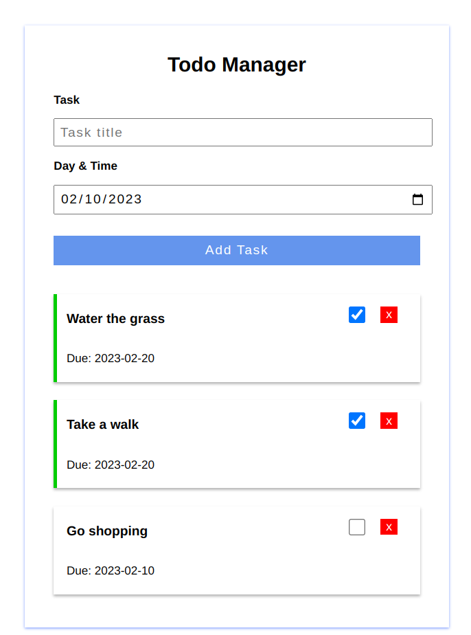

# Todo List Application

[API Documentation](https://documenter.getpostman.com/view/4654837/UVeFNST4)

Todo list application consisting of a Vue frontend and Golang backend

## Setup

- Clone repo

- run `docker-compose up`

- Vue app will run on `localhost`  (port 80)

- Go API will run on `localhost:3000`

## Test Data

### User accounts

| email   | password    | 
| :-------: |:------------:|
| admin@mail.com    | 1234      | 
| user1@mail.com    | 1234      | 
| user2@mail.com    | 1234      | 
| user3@mail.com    | 1234      | 
| user4@mail.com    | 1234      | 